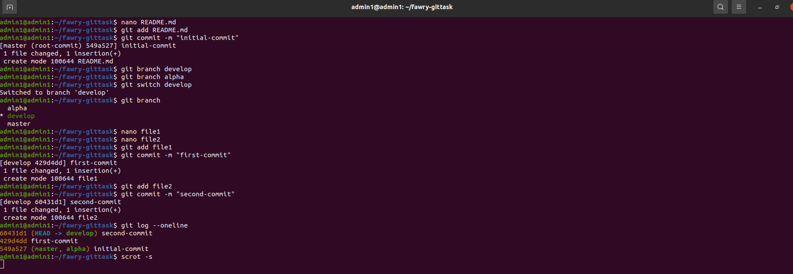
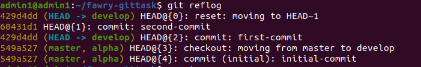
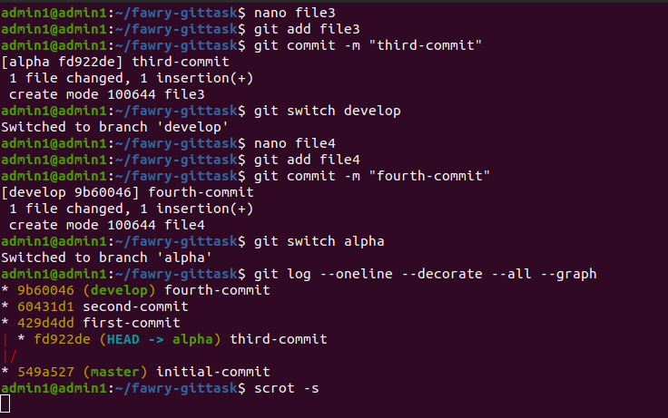
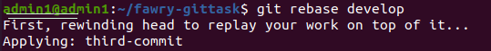

# Task 1

## Screenshots of the Results

### Used Scrot which is a basic, flexible tool that offers a number of handy options for taking screen captures from the Linux command line.

### Step 1: Git log of 1st and 2nd commits

### Step 2: reset --hard

### Step 3: Reflog

### Step 4: Resetting after Reflog

### Step 5: Git log result

### Step 6: Final rebase result

